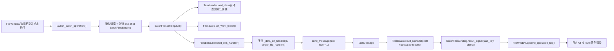

# RD-tools 后端批量处理开发流程规范

本文档用于约束 RD-tools 当前“批量处理后端”的开发方式，目标是让后续新增任务、重构任务、排查问题时都遵守同一套规则。

本文档关注的是：

- 任务后端如何分层
- 新任务应该如何接入
- 消息、日志、线程、路径应该怎么写
- 哪些写法是推荐的，哪些写法应避免

本文档不覆盖：

- Fluent UI 视觉设计
- 设置页组件样式
- 帮助页内容组织

这些内容请看 `docs/dev/fluent-ui-design.md`。

当前任务懒加载机制的设计与边界，不在本文详细展开；请参考 `docs/dev/lazy-load-design.md`。

## 1. 当前后端链路

当前批量处理后端的主链路如下：



对应关键文件：

- `main.py`
  - 任务注册
  - `launch_batch_operation()`
  - `BatchFilesBinding`
  - 后端与 UI 的接线
- `core/task_loader.py`
  - 任务类动态加载
  - 类缓存
- `modules/files_basic.py`
  - 批量处理基类
  - 日志会话
  - bootstrap reporter
  - 工作目录与路径解析
- `core/task_message.py`
  - `TaskMessage`
  - `MessageLevel`
- `widgets/file_page.py`
  - 任务日志展示
  - 日志颜色策略

## 2. 设计原则

### 2.1 业务模块只负责处理，不直接操作 UI

业务模块不应该：

- 直接创建 `QWidget`
- 直接操作页面控件
- 直接调用通知组件
- 假设自己运行在主线程

业务模块应该：

- 只通过 `send_message()` 输出运行过程
- 只通过返回值、异常和输出文件表达处理结果
- 把 UI 相关决策交给 `FileWindow` 和 `MainWindow`

### 2.2 新代码默认继承 `FilesBasic`

凡是“按目录批量扫描 -> 逐文件或逐子目录处理 -> 输出结果”的任务，默认继承 `FilesBasic`。

除非有明确理由，否则不要自己重写一套：

- 目录选择逻辑
- 线程分发逻辑
- 日志会话逻辑
- 结果信号逻辑

### 2.3 消息结构化，文本不再承载级别语义

后端消息统一使用：

- `TaskMessage`
- `MessageLevel.INFO`
- `MessageLevel.WARNING`
- `MessageLevel.ERROR`
- `MessageLevel.SUCCESS`

新代码的约束是：

- 使用 `send_message(text, level=...)`
- 既然已经传了 `level=`，就不要再写 `Error:`、`Warning:`、`SUCCESS:` 这类前缀
- 旧代码兼容推断只作为过渡，不是长期规范

正确示例：

```python
self.send_message("未找到有效模型文件", level=MessageLevel.ERROR)
self.send_message("输出文件已存在，将被覆盖", level=MessageLevel.WARNING)
self.send_message(f"已保存结果: {output_path}", level=MessageLevel.SUCCESS)
```

不推荐示例：

```python
self.send_message("Error: 未找到有效模型文件")
self.send_message("Warning: 输出文件已存在，将被覆盖")
self.send_message("SUCCESS: 已保存结果")
```

## 3. 路径与文件系统规范

### 3.1 严禁在任务运行时调用 `os.chdir()`

批量任务允许并发执行，不允许通过修改进程级当前目录来驱动文件处理。

原因：

- 多任务并发时会互相污染路径上下文
- 相对路径和日志目录会串掉
- 子进程命令的工作目录不可预测

正确做法：

- `FilesBasic` 维护 `self._work_folder`
- 统一用绝对路径拼接
- 需要把相对路径映射到工作目录时，使用 `_resolve_work_path()`

### 3.2 输出目录必须显式拼绝对路径

规则：

- 输入路径：`os.path.join(self._work_folder, _data_dir, file_name)`
- 输出路径：`os.path.join(self._work_folder, outfolder_name)`
- 不要依赖当前工作目录

### 3.3 每次任务运行使用独立日志文件

日志规则：

- 日志文件由 `FilesBasic` 在 `set_work_folder()` 后创建
- 运行中持续追加写入
- 任务结束时关闭句柄
- 日志目录默认位于 `work_folder/log_folder_name`

不再推荐“所有消息先堆内存，最后一次性落盘”的写法。

## 4. 线程与并发规范

### 4.1 外层任务线程和内层文件线程的职责

当前模型分两层：

1. `BatchFilesBinding(QThread)`
   - 负责把单次任务执行放到后台线程运行
   - 防止 UI 主线程卡住

2. `ThreadPoolExecutor`
   - 负责一个任务内部的目录级或文件级并发

约束：

- 只有真正 I/O 密集或互不依赖的子任务才开启 `parallel`
- 如果第三方库有线程安全问题，应显式关闭并发
- 不要为了“看起来更快”盲目把所有任务都并行化

### 4.2 并发任务中的消息输出

并发子任务允许同时调用 `send_message()`。

依赖点：

- `FilesBasic` 内部用锁保护日志文件写入
- UI 通过 Qt 信号队列回到主线程

因此新任务不需要自己再造：

- 日志写锁
- UI 线程切换

但需要保证：

- 单条消息足够短小且完整
- 不要在热循环里高频刷消息

## 5. 消息与日志规范

### 5.1 `TaskMessage` 的角色

`TaskMessage` 是后端与 UI 之间的统一消息载体，字段至少包括：

- `text`
- `level`
- `created_at`

用途：

- UI 根据 `level` 上色
- 文件日志统一格式化
- 后续可继续扩展 `source`、`run_id` 等字段

### 5.2 级别使用规范

`INFO`

- 任务开始
- 当前处理对象
- 正常流程进度
- 环境信息

`WARNING`

- 自动降级
- 参数纠正
- 文件已存在
- 某个子项跳过，但任务整体可继续

`ERROR`

- 当前文件处理失败
- 参数非法
- 依赖缺失
- 子流程异常

`SUCCESS`

- 关键输出保存完成
- 任务整体完成

### 5.3 traceback 的处理

如果需要输出堆栈：

```python
self.send_message(f"处理失败: {exc}", level=MessageLevel.ERROR)
self.send_message(traceback.format_exc(), level=MessageLevel.ERROR)
```

要求：

- 先给一条人能看懂的摘要
- 再补 traceback
- 不要只打一大段堆栈不解释

## 6. 新任务的标准开发流程

### 6.1 新建模块类

规则：

- 放在 `modules/`
- 继承 `FilesBasic`
- 在 `__init__()` 里声明：
  - `log_folder_name`
  - `out_dir_prefix`
  - `suffixs`
  - `parallel`

示例：

```python
import os

from modules.files_basic import FilesBasic
from core import MessageLevel


class ExampleHandler(FilesBasic):
    def __init__(self):
        super().__init__(
            log_folder_name='example_log',
            out_dir_prefix='example-',
            parallel=False,
        )
        self.suffixs = ['.txt']

    def single_file_handler(self, abs_input_path: str, abs_outfolder_path: str):
        if not self.check_file_path(abs_input_path, abs_outfolder_path):
            self.send_message("check_file_path 校验失败", level=MessageLevel.ERROR)
            return

        self.send_message(
            f"开始处理: {os.path.basename(abs_input_path)}",
            level=MessageLevel.INFO,
        )

        try:
            output_path = os.path.join(abs_outfolder_path, 'result.txt')
            with open(output_path, 'w', encoding='utf-8') as fh:
                fh.write('done')
        except Exception as exc:
            self.send_message(f"处理失败: {exc}", level=MessageLevel.ERROR)
            return

        self.send_message(f"结果已保存: {output_path}", level=MessageLevel.SUCCESS)
```

### 6.2 判断是重写 `_data_dir_handler()` 还是只写 `single_file_handler()`

只重写 `single_file_handler()` 的场景：

- 每个输入文件彼此独立
- 输出目录结构简单
- 不需要跨文件聚合

需要重写 `_data_dir_handler()` 的场景：

- 需要先扫描一层子目录
- 需要跨文件配对
- 需要先聚合后输出
- 输入不是单文件，而是一组相关文件

### 6.3 在 `main.py` 注册任务

新增任务必须：

1. 在 `build_task_descriptors()` 中增加 `TaskDescriptor`
2. 补齐 `module_path`、`class_name`、`settings_group`
3. 补齐标题、描述、图标和默认参数

当前不再要求在 `main.py` 顶层导入任务类；任务类由运行时懒加载机制按需解析。详细参考 `docs/dev/lazy-load-design.md`。

### 6.4 如果任务需要配置项

配置项的接入顺序：

1. `configs/settings.json`
2. `modules/app_settings.py`
3. `widgets/setting_page.py`
4. 任务类 `__init__()` 参数

要求：

- 设置项名和类参数名保持一致
- 默认值只保留一份主定义
- 配置读写仍统一走 `AppSettings`，不要自己再做一套配置系统
- 当前正式语义是：修改设置只影响下次执行，不再实时推送到正在运行的任务实例

## 7. 代码编写规范

### 7.1 日志规范

必须：

- 使用 `send_message(..., level=...)`
- 文本写清楚“对象 + 动作 + 结果”

推荐：

- 处理开始：`开始处理: xxx`
- 处理中：`正在生成视频: xxx`
- 成功：`已保存: xxx`
- 警告：`输出文件已存在，将被覆盖`
- 错误：`模型加载失败: xxx`

避免：

- 只写 `Error`
- 只写 `Fail`
- 没有对象上下文的短句

### 7.2 异常处理规范

规则：

- 文件级失败尽量在文件级处理并继续后续文件
- 只有整任务无法继续时才向上抛异常
- 捕获异常后必须补一条清晰消息

不推荐：

```python
except Exception:
    pass
```

推荐：

```python
except Exception as exc:
    self.send_message(f"处理失败: {exc}", level=MessageLevel.ERROR)
    return
```

### 7.3 输出文件规范

要求：

- 输出路径可预测
- 输出文件名稳定
- 覆盖已有文件时要提前提示

例如：

```python
if os.path.exists(output_path):
    self.send_message(
        f"输出文件已存在，将被覆盖: {output_path}",
        level=MessageLevel.WARNING,
    )
```

## 8. 验证流程

后端任务改动后，至少做下面几件事：

1. 语法检查

```bash
python -m compileall main.py main_window.py core modules widgets ui
```

2. 路径检查

- 确认没有新引入 `os.chdir()`
- 确认输出目录都基于 `self._work_folder`

3. 日志检查

- 任务运行中日志文件是否持续写入
- UI 日志是否正常显示
- `error / warning / success` 是否颜色正确

4. 异常检查

- 人为制造一个失败输入
- 确认 UI 有错误消息
- 确认日志文件有对应错误记录

## 9. 评审清单

提交前自检至少覆盖以下问题：

- 是否继承了 `FilesBasic`
- 是否使用 `send_message(..., level=...)`
- 是否仍然依赖 `os.chdir()`
- 是否有相对路径写盘
- 是否存在 `print()` 混进任务主链路
- 是否对可恢复问题使用了 `WARNING`
- 是否对失败路径输出了可读错误信息
- 是否在需要时补充了 traceback
- 是否验证了日志文件持续写入
- 是否验证了 UI 日志显示

## 10. 当前推荐做法总结

一句话总结当前推荐模式：

> 任务后端负责处理和结构化消息；`FilesBasic` 负责目录、日志和消息分发；UI 负责展示和颜色；所有路径都以 `work_folder` 为根；所有级别都显式写在 `level=` 里，而不是塞进字符串前缀。

后续如果继续重构后端，优先级建议如下：

1. 继续把高频模块的 `send_message()` 改成显式 `level=`
2. 逐步去掉剩余依赖文本前缀的旧消息
3. 按任务需要补更精细的上下文字段，而不是引入另一套日志框架
